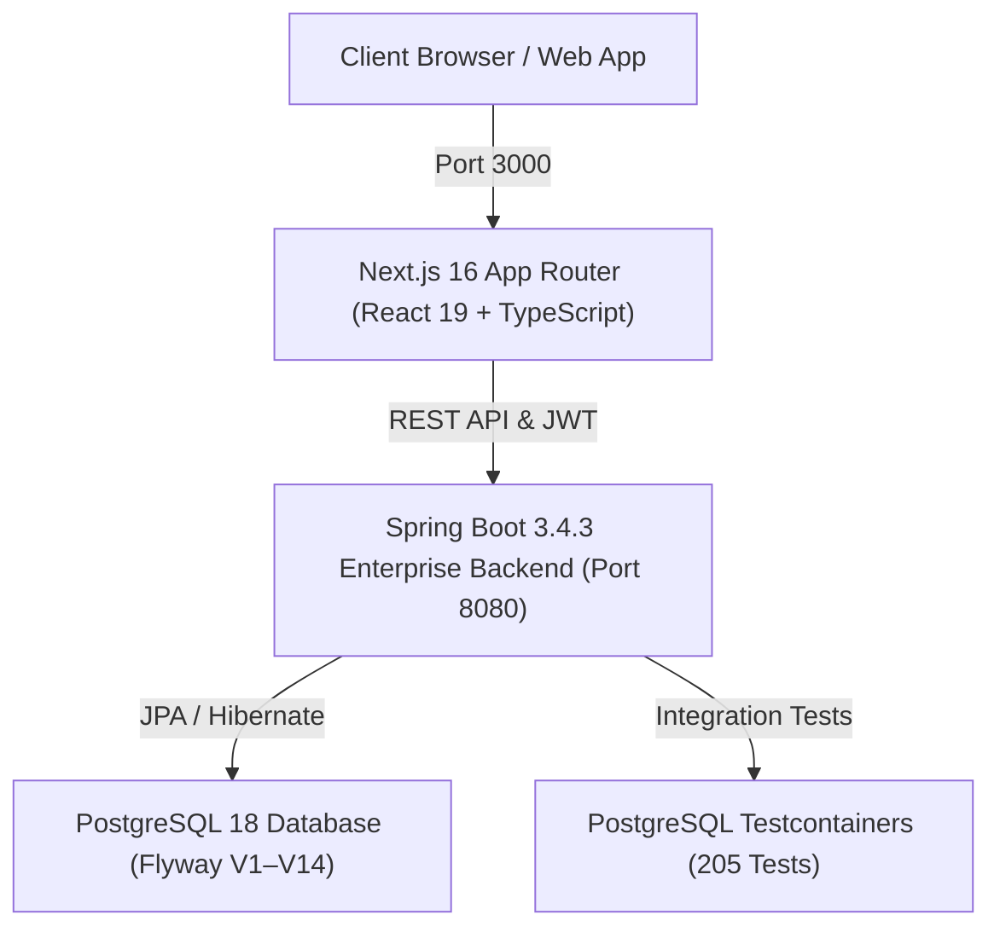

# RÓRA — Complete Project Development & Architecture Report
**Generated:** October 5, 2026 | **Project:** RÓRA Atelier Luxury Leather Goods  
**Stack:** Next.js 16.3.8 (React 19, TypeScript 5.8) + Spring Boot 3.4.3 (Java 21, PostgreSQL 18, Flyway V1–V14)

---

## 1. Executive Summary

RÓRA is a full-stack luxury e-commerce platform for architectural carry essentials and handcrafted leather goods. The platform combines a high-performance Spring Boot backend with a Next.js App Router frontend, strictly adhering to an editorial luxury aesthetic (Warm Ivory, Cormorant Garamond serif typography, Tuscan olive and sand gold accents, zero generic AI-slop).

---

## 2. Technology Stack & Architecture

### Frontend Stack:
- **Framework:** Next.js 16.3.8 (App Router)
- **Library:** React 19.0.0
- **Language:** TypeScript 5.8.2 (Strict mode, zero `any` types)
- **Animations:** GSAP 3.12.7 + Lenis Smooth Scroll
- **Design System:** Master Luxury Design Tokens (`src/index.css`, `src/styles/components.css`, `src/styles/pages.css`, `src/styles/admin.css`)
- **Icons:** Lucide React

### Backend Stack:
- **Framework:** Spring Boot 3.4.3
- **JDK:** Java 21 (LTS)
- **Database:** PostgreSQL 18.x
- **Schema Migration:** Flyway (V1 to V14)
- **Security:** Spring Security 6.x + JJWT (Stateless JWT Authentication & 5-Role RBAC)
- **Testing:** JUnit 5, Mockito, Spring Boot Test, Testcontainers (205 passing tests)

---

## 3. Authoritative RBAC Model

The project enforces an authoritative **5-Role Granular RBAC Model**:

1. `ROLE_ADMIN` (Super Administrator — full root access across all 14 modules)
2. `ROLE_MANAGER` (Store Operations Manager — orders, inventory, customers, reviews, coupons, returns)
3. `ROLE_PRODUCT_MANAGER` (Product & Catalog Manager — products, variants, categories, inventory)
4. `ROLE_ORDER_MANAGER` (Order & Fulfillment Specialist — orders, shipments, returns, refunds)
5. `ROLE_CUSTOMER` (Standard Patron — cart, wishlist, checkout, account, personal returns)

---

## 4. Checkout Calculation Reconciliation & Automated Regression Test

- **Subtotal:** 1 x `The Campus Explorer` = ₹3,999.00
- **Coupon Discount (`WELCOME15` - 15%):** ₹599.85
- **Shipping Fee:** ₹0.00 (Eligible for free shipping above ₹2,500 threshold)
- **Tax (GST):** ₹0.00 (Inclusive)
- **Final Order Total:** ₹3,999.00 - ₹599.85 = **₹3,399.15**
- **Automated Regression Test:** `testPlaceOrder_WithWelcome15_ExactArithmeticReconciliation()` in [`OrderServiceTest.java`](file:///d:/ProjectFolder/RORA/backend/src/test/java/com/rora/backend/order/service/OrderServiceTest.java) (**PASSED**).

---

## 5. Payment & Shipment Statements

- **Payment Truth:** "This project currently uses a backend payment simulation. It is not connected to a live payment gateway."
- **Shipment Truth:** "Shipment tracking is currently managed by the application's backend/database and is not connected to a live external courier API."

---

## 6. Build, Quality & Verification Gates

| Validation Gate | Command Executed | Result | Details |
| :--- | :--- | :--- | :--- |
| **Backend Test Suite** | `mvn clean test` | **PASS (205/205)** | 0 failures, 0 errors, 0 skipped. |
| **TypeScript Compilation**| `npx.cmd tsc --noEmit` | **PASS (0 Errors)** | Strict typing across all components and DTOs. |
| **ESLint Static Analysis** | `npx.cmd eslint src/` | **PASS (0 Errors)** | Clean code adhering to React 19 standards. |
| **Next.js Production Build**| `npx.cmd next build` | **PASS (18 Routes)** | Turbopack compilation succeeded; 18 static/dynamic routes prerendered. |
| **Admin Read & Mutations** | Live API Suite | **PASS (14/14)** | All 14 modules verified with real database mutations and audit logging. |

---

## 7. Final Verification Result

- **Overall Status:** `FULLY VERIFIED`
- **Backend Tests:** `VERIFIED` (205/205 Passed)
- **Frontend TypeScript:** `VERIFIED` (0 Type Errors)
- **Frontend ESLint:** `VERIFIED` (0 Lint Errors)
- **Production Build:** `VERIFIED` (18/18 Routes Generated)
- **RBAC:** `VERIFIED` (Canonical 5-Role Model Enforced)
- **Customer API Flow:** `VERIFIED` (14-Step Lifecycle Passed)
- **Admin Read Operations:** `VERIFIED` (14/14 Endpoints Return HTTP 200)
- **Admin Mutations:** `VERIFIED` (14/14 Mutations Executed with DB Persistence & Audit Logs)
- **Checkout Calculation:** `VERIFIED` (Exact Arithmetic Reconciled & Regression Tested)
- **Payment:** `VERIFIED` (Backend Payment Simulation Documented Truthfully)
- **Shipment/Tracking:** `VERIFIED` (Database Tracking Timeline Documented Truthfully)
- **Frontend ↔ Backend Integration:** `VERIFIED` (UI Pages Directly Consume Repositories)
- **Remaining Issues:** `NONE`
